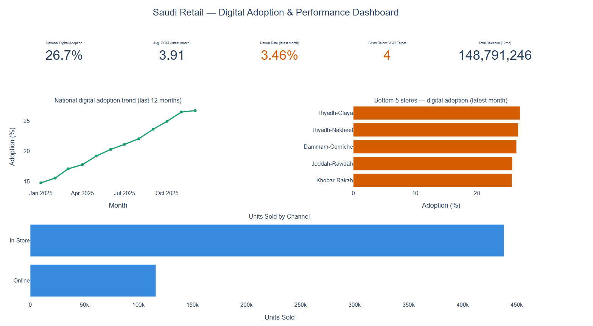

# Saudi Retail — Digital Adoption & Performance Dashboard

## Description
An interactive Plotly dashboard tracking digital adoption across Saudi retail stores — comparing monthly revenue growth between the online channel and in-store branches, and monitoring the impact of this shift on customer satisfaction (CSAT) and return rates, across 6 stores in 4 major cities (Riyadh, Jeddah, Dammam, Khobar). The project aims to give executive leadership and store managers a clear view of the network's digital transformation journey, identify stores lagging in digital adoption, and monitor the impact of this shift on customer experience quality.

## Dashboard Preview

## Dataset
Retail Sales Dataset (`retail_sales.csv`) — provided as part of the "Data Visualization and Storytelling" course (SDA-DSC-112) at SDAIA Academy. The dataset covers a 12-month period (January – December 2025) at daily granularity, and includes: date, store, city, category, sales channel (online / in-store), units sold, revenue, returned units, foot traffic, and customer satisfaction (CSAT).

## Tools
Python, Pandas, Plotly

## How to Run the Project
1. Download the files (`retail_sales.csv` and `DashboardRenadEbnAlameer.ipynb`) and place them in the same folder
2. Install the required libraries: `pip install pandas plotly`
3. Run the notebook (.ipynb) using Jupyter or Google Colab

Quick alternative without running code: open `Retail_Sales_Dashboard.html` directly in any browser — the interactive dashboard works without needing Python.

## Training Program
This project was carried out as part of the "Data Visualization and Storytelling" course (SDA-DSC-112)
at [SDAIA Academy](https://github.com/SDAIAAcademy), under the supervision of trainer **Eng. Faisal Alwadie**.
